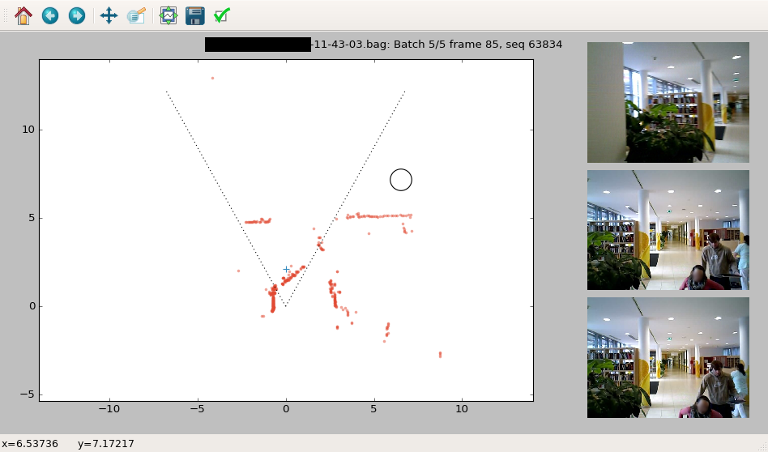

# laser-detection-annotator
A tool to annotate/label detections in a stream of laser data. Can show supporting video if available.

[](screenshot.png)

**TODO**: Documentation both of usage and of customization!

Usage:

```
python anno1602.py [--dry-run] subpath-basename
```

Have a look at the code, all configuration parameters are at the beginning and commented.
